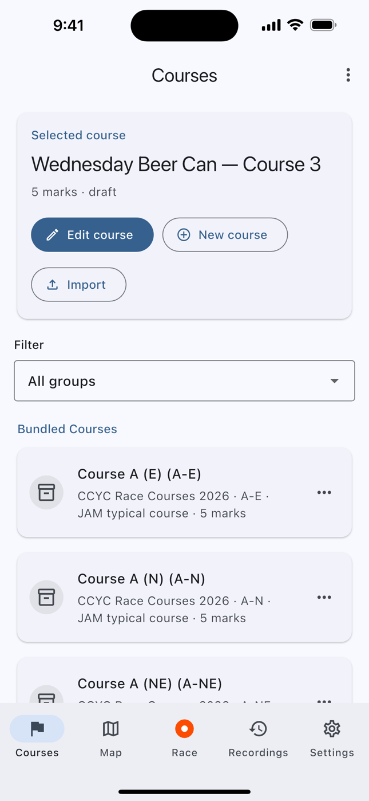
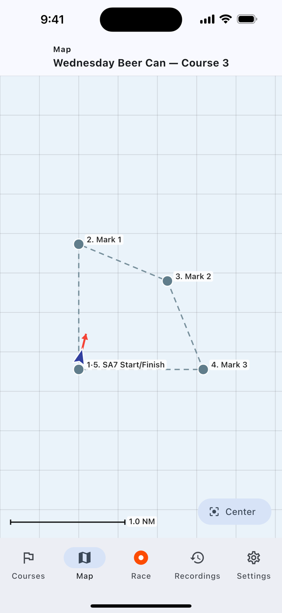
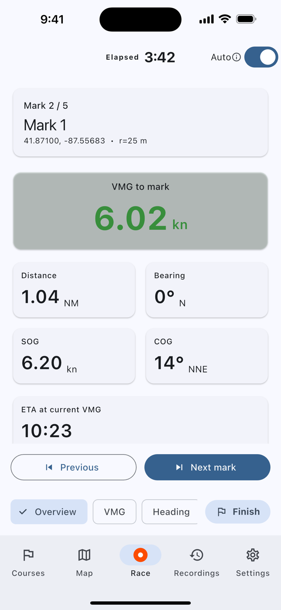

# Race Mate — Sailing Race Computer

[](https://github.com/umutsoysal/SailRaceComputer/actions/workflows/ci.yml)
[](https://github.com/umutsoysal/SailRaceComputer/actions/workflows/deploy_web.yml)
[](https://flutter.dev)
[](#platform-notes)
[](LICENSE)

A GPS-powered sailing race companion app for iOS, Android, and Web. Race Mate tracks your boat's position against a pre-defined race course and displays the real-time navigation metrics you need during a regatta.

---

## Features

### Live Race Navigation
- **Distance to next mark** — great-circle distance in nautical miles
- **Bearing to next mark** — true bearing in degrees with compass abbreviation
- **VMG (Velocity Made Good)** — speed component directly toward the mark; highlighted green when positive (closing), red when negative (opening)
- **SOG / COG** — Speed and Course Over Ground from GPS
- **ETA** — estimated time of arrival at current speed
- **Auto-advance** — automatically steps to the next mark when the boat enters the rounding radius
- **GPS status** — live fix indicator with accuracy display and error recovery

### Course Management
- Build a course from scratch by adding buoys (name, lat/lng, rounding radius)
- Drag to reorder marks
- Edit or delete individual buoys
- Rename the course
- Persist the active course across app restarts

### Course Library
- Browse bundled Chicago courses (Columbia YC beer can, CCYC, MORF)
- Save any course to a personal library stored on-device
- Import courses from a JSON file (file picker)
- Import by pasting JSON from the clipboard
- Export / share courses as `.srcourse.json` files via the native share sheet (Mail, Messages, AirDrop, etc.)
- View raw JSON in-app for debugging or manual sharing

### Apple Watch / Wear OS Companion
- Sends live race metrics to a paired watch via a native `MethodChannel`

---

## Screenshots

| Courses | Map | Race |
|:---:|:---:|:---:|
|  |  |  |
| Pick a course from the bundled library or build your own | Offline top-down plot of the course with your boat and heading | Live metrics with the race clock running and auto-advance armed |

Captured from a real build driven by the boat simulator — see
[docs/screenshots.md](docs/screenshots.md) to retake them.

---

## Getting Started

### Prerequisites

| Tool | Version |
|------|---------|
| Flutter | 3.41.1 (stable) — pinned in [`.github/actions/setup-flutter`](.github/actions/setup-flutter/action.yml) |
| Dart SDK | ^3.11.0 (ships with Flutter) |
| Xcode | 15+ (iOS builds) |
| Android Studio | Flamingo+ (Android builds) |

`./tool/flutterw.sh` and `./tool/dartw.sh` locate the SDK for you, or set
`FLUTTER_BIN=/path/to/flutter`.

### Install dependencies

```bash
make bootstrap
```

### Optional: configure Firebase analytics

Firebase core and analytics scaffolding are wired into the app, but they stay
disabled until you connect the repo to a real Firebase project. See
[docs/firebase.md](docs/firebase.md).

### Run on a device or simulator

```bash
# Default (production entry point — real GPS)
./tool/flutterw.sh run

# Target a specific device
./tool/flutterw.sh run -d iphone   # iOS Simulator
./tool/flutterw.sh run -d android  # Android emulator / device
./tool/flutterw.sh run -d chrome   # Web
```

### Run the boat simulator (no GPS required)

For development and testing without a physical device or GPS signal, use the built-in boat simulator:

```bash
./tool/flutterw.sh run -t lib/dev/sim_main.dart -d chrome
```

The simulator opens a top-down course map with controls for heading, speed, and position. It feeds simulated positions into the same `PositionSource` abstraction used by the production app.

To drive the *real* app UI against the simulated boat — which is how the
screenshots above are made — use the screenshot harness instead:

```bash
./tool/flutterw.sh run -t lib/dev/screenshot_main.dart -d chrome
```

### Run tests

```bash
make test
```

Or the full local equivalent of CI — format check, analysis, tests with the
coverage floor enforced, and the release builds:

```bash
make ci
```

`make coverage-check` prints per-file line coverage worst-first and fails if the
total drops below the floor in [`tool/check_coverage.dart`](tool/check_coverage.dart).

### Generate app icons

```bash
python tool/make_icon.py          # Render 1024×1024 source PNGs
./tool/flutterw.sh pub run flutter_launcher_icons  # Slice into platform assets
```

### Build release artifacts

```bash
make build-all
make build-ios-no-codesign   # macOS only
```

---

## Project Structure

```
lib/
├── main.dart                # Production entry point
├── app_shell.dart           # Five-tab shell (Courses, Map, Race, Recordings, Settings)
├── models/
│   └── course.dart          # Course & Buoy data models
├── screens/
│   ├── course_screen.dart   # Course builder & library UI
│   ├── map_screen.dart      # Top-down course map with live position
│   ├── race_screen.dart     # Live navigation display & track recording
│   ├── library_screen.dart  # Saved courses and past recordings
│   ├── settings_screen.dart # Preferences, feedback, legal
│   └── legal_document_screen.dart
├── services/
│   ├── app_analytics.dart      # Firebase Analytics wrapper (no-op until configured)
│   ├── course_file.dart        # .srcourse.json encode / decode / validation
│   ├── course_library.dart     # Bundled + saved course discovery
│   ├── course_store.dart       # SharedPreferences persistence
│   ├── location_service.dart   # Fix lifecycle, errors, and recovery
│   ├── position_source.dart    # GPS abstraction interface
│   ├── race_computations.dart  # Race clock, course metrics, mark advance
│   ├── race_session_store.dart # Recorded sessions + GPX export
│   └── watch_service.dart      # Watch companion MethodChannel
├── utils/
│   └── geo.dart             # Haversine distance, bearing, VMG, ETA
├── widgets/
│   ├── course_map_painter.dart          # Offline canvas chart
│   ├── help_tour.dart                   # First-launch spotlight tour
│   ├── recording_map_preview.dart
│   └── imported_course_picker_dialog.dart
└── dev/                     # Development-only (not shipped)
    ├── sim_main.dart              # Simulator entry point
    ├── screenshot_main.dart       # Screenshot harness entry point
    ├── boat_simulator.dart        # Headless 5 Hz boat physics
    ├── simulator_screen.dart      # Top-down map + controls
    ├── simulated_position_source.dart
    └── course_map_painter.dart

assets/
├── branding/
│   ├── icon.png             # 1024×1024 app icon source
│   └── icon_foreground.png  # Android adaptive icon foreground
└── courses/                 # Auto-discovered; drop in a JSON file to add one
    ├── beercan_south.json
    ├── ccyc_courses.json
    ├── morf_courses.json
    └── template.json

test/                        # 114 tests, 75%+ line coverage enforced in CI

tool/
├── check_coverage.dart          # Coverage summary + floor enforcement
├── make_icon.py                 # Generates source icon PNGs with Pillow
├── version.dart                 # Version metadata & build args
└── verify_release_version.dart  # Guards that a tag matches app_version.json
```

---

## Course File Format

Courses are stored and shared as `.srcourse.json` files. The format is intentionally human-readable and diff-friendly.

```json
{
  "format": "sail-race-course",
  "version": 2,
  "name": "Wednesday Series",
  "createdAt": "2026-06-04T12:00:00Z",
  "notes": "Reusable buoy catalog plus multiple race layouts",
  "buoys": [
    {
      "id": "sa7",
      "name": "Start / Finish",
      "lat": 41.852833,
      "lng": -87.556833,
      "roundingRadiusM": 30
    },
    {
      "id": "m1",
      "name": "Windward",
      "lat": 41.892,
      "lng": -87.6101,
      "roundingRadiusM": 25
    }
  ],
  "courses": [
    {
      "id": "L1",
      "name": "Long Course 1",
      "route": ["sa7", "m1", "sa7"]
    }
  ]
}
```

**Validation rules applied on import:**
- `format` must equal `"sail-race-course"`
- `version` may be `1` or `2`; v1 still imports for backward compatibility
- `lat` must be in `[-90, 90]`
- `lng` must be in `[-180, 180]`
- `roundingRadiusM` defaults to `25.0` if omitted
- In v2, `buoys[].id` and `courses[].id` must be unique
- In v2, each course must define either `turns` or `route`, and every referenced buoy id must exist

When a v2 file contains multiple courses, the app prompts you to choose which layout to load.

Filenames are auto-slugified: `"My Cool Race!!"` → `my-cool-race.srcourse.json`.

---

## Geographic Math

All calculations are in `lib/utils/geo.dart` and require no external dependencies.

| Function | Description |
|----------|-------------|
| `distanceMeters(a, b)` | Great-circle distance via the haversine formula |
| `bearingDegrees(a, b)` | Initial true bearing from `a` to `b` (0–360°) |
| `vmgMs(speed, course, bearing)` | Velocity made good toward target bearing |
| `destinationPoint(start, distM, bearing)` | Endpoint given start, distance, bearing |
| `knotsToMs()` / `msToKnots()` | Unit conversion |
| `metersToNm()` | Metres to nautical miles |
| `compass(deg)` | Degree → cardinal abbreviation (N, NE, ESE, …) |
| `formatEta(Duration)` | Format as `H:MM:SS` or `M:SS` |

VMG is positive when the boat is closing on the mark and negative when opening.

---

## Dependencies

| Package | Constraint | Purpose |
|---------|-----------|---------|
| `geolocator` | ^14.0.3 | GPS on iOS, Android, Web |
| `shared_preferences` | ^2.5.5 | On-device course & library storage |
| `file_selector` | ^1.0.3 | Cross-platform file picker for import |
| `share_plus` | ^13.2.1 | Native share sheet for export |
| `url_launcher` | ^6.3.0 | Feedback and notice-board links |
| `firebase_core` | ^4.11.0 | Firebase bootstrap (inert until configured) |
| `firebase_analytics` | ^12.4.5 | Usage analytics (inert until configured) |
| `cupertino_icons` | ^1.0.8 | iOS icon library |
| `flutter_launcher_icons` | ^0.14.4 | App icon generation (dev) |
| `flutter_lints` | ^6.0.0 | Static analysis (dev) |

Dependabot opens grouped weekly update PRs for pub, Gradle, Bundler, and
GitHub Actions; patch and minor bumps auto-merge once CI is green.

---

## Platform Notes

### iOS
- Requires `NSLocationWhenInUseUsageDescription` in `Info.plist` (already configured).
- Background location is **not** requested; the screen must stay on during a race.

### Android
- Requires `ACCESS_FINE_LOCATION` permission (already configured).
- Tested on API 26+.

### Web
- Uses the browser Geolocation API via `geolocator`.
- HTTPS is required for geolocation in production web deployments.

---

## Bundled Courses

Every `assets/courses/*.json` file is discovered automatically at runtime — add
a file and it shows up in the library, no code change required.

| File | Description |
|------|-------------|
| `beercan_south.json` | Columbia YC Wednesday Night Beer Can Series — 9 buoys, 16 course layouts |
| `ccyc_courses.json` | CCYC Race Courses — 9 buoys, 32 course layouts |
| `morf_courses.json` | MORF Courses — 9 buoys, 16 course layouts |
| `template.json` | Annotated starting point for building your own course file |

---

## Contributing

Please see [CONTRIBUTING.md](CONTRIBUTING.md) for workflow and quality expectations.

### Repository quality features
- **CI on every PR** — formatting, static analysis, 114 tests, an enforced
  line-coverage floor, workflow linting, and Web/Android release builds
- **iOS build** on `main`, on demand, and on PRs labelled `ios`
- **Pinned toolchain** — one composite action installs the same Flutter version
  everywhere, so a new Flutter stable can never break CI unannounced
- **Actions pinned to commit SHAs**, kept current by Dependabot
- **Dependency review** blocks PRs that pull in a known-vulnerable or
  incompatibly-licensed package
- **Dependabot** for pub, Gradle, Bundler, and GitHub Actions, with grouped PRs
  and auto-merge for patch/minor once CI is green
- **Automatic PR labelling** from changed paths
- **GitHub Pages** web deployment on every push to `main`
- **Tagged release workflow** publishing signed Android, unsigned iOS, and Web
  artifacts with SHA-256 checksums
- Issue templates, PR template, CODEOWNERS, Security Policy, Code of Conduct

CI/CD setup details are documented in [docs/ci-cd.md](docs/ci-cd.md), packaging
details in [docs/release.md](docs/release.md), and the screenshot workflow in
[docs/screenshots.md](docs/screenshots.md). Release history lives in
[CHANGELOG.md](CHANGELOG.md).

---

## License

MIT — see `LICENSE` for details.
